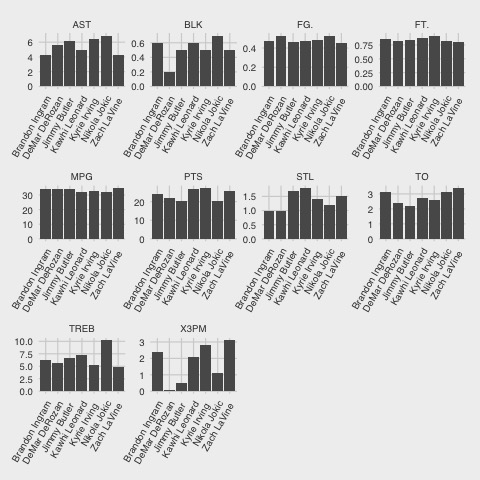
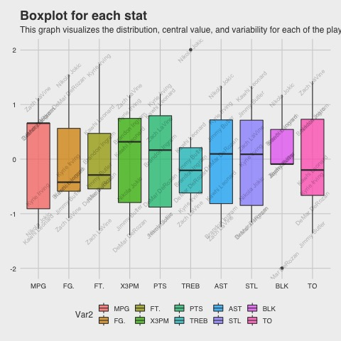
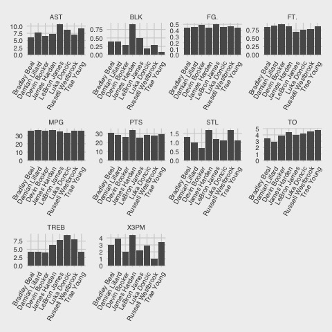
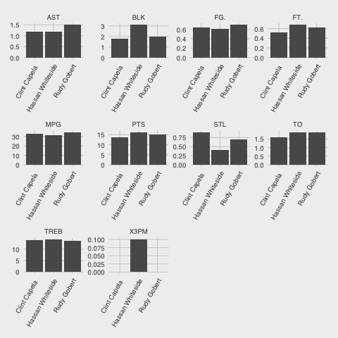
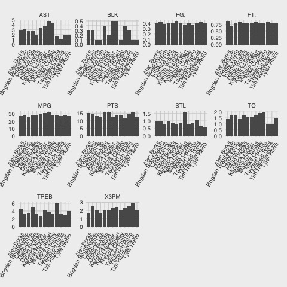
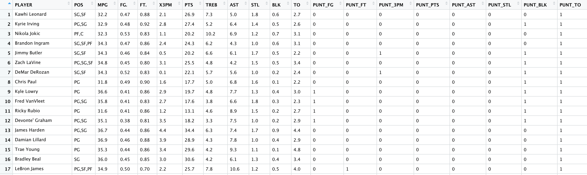

# fantasynba

I started getting into fantasy basketball in the 2019-2020 season, and began investigating methods which would maximize my chances of winning a league. Like many other beginners, I came across "punting". Punting is a strategy of completely giving up on one or more categories in a head to head category league in order to select players who maximize your team's strengths in other categories. If you don't know much about basketball, it's difficult to determine which punt cateogory or categories a specific player belongs to. Thus, I thought maybe I could use K-Means to cluster players into their respective punt categories.

## Dataset

I exported the rankings data from [Hashtag Basketball](https://hashtagbasketball.com/fantasy-basketball-rankings) into microsoft excel, applied some manual data cleaning, and simply loaded the data into R. The data can be found [here](https://github.com/oaarnikoivu/fantasynba/blob/master/rankings.xlsx).

## Cluster examples

### Studs

### Centers

### Shooters

---

After running KMeans to identify players in similar clusters, I started noticing some similarities for certain players. I created a multi-label classification dataset by adding all the possible punt categories. If players in specific clusters have a value below a certain threshold, the category gets labelled with a 1 (indicating that the stat is puntable), otherwise with a 0. For example, if players in the "stud" cluster have a field goald percentage of less than 0.45, a 1 is added under the "PUNT_FG" column. The dataset is available [here](https://github.com/oaarnikoivu/fantasynba/tree/master/data).

## Decision Tree Classifier

I feed the dataset into a decision tree classifier using Scikit Learn and assess the model performance on Anthony Davis, Nikola Vucevic, Giannis Antetokounmpo, Zion Williamson, LeBron James, Devonte' Graham, Ben Simmons, Julius Randle and Domantas Sabonis. Below we see that the classifier does a good job in categorizing these players into their correct punting categories.

